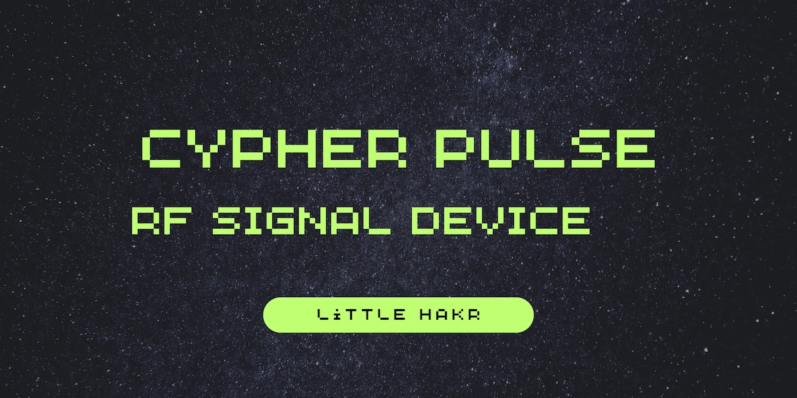
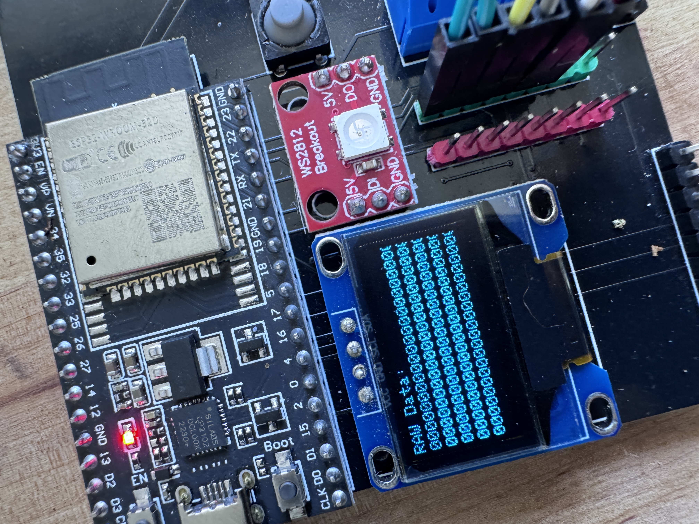
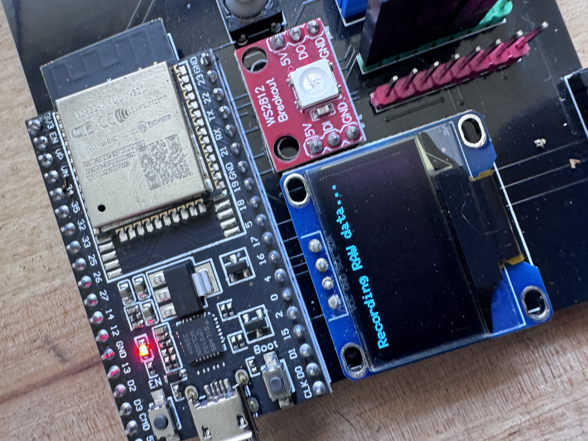
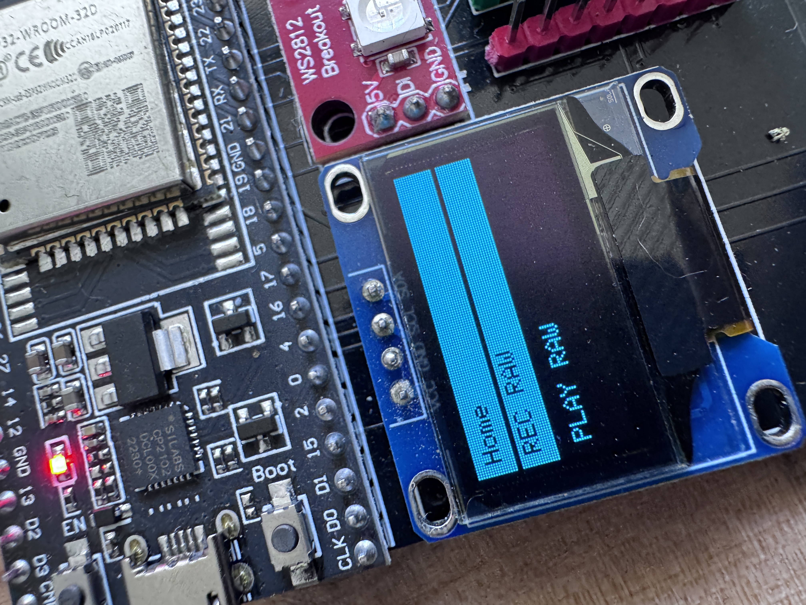
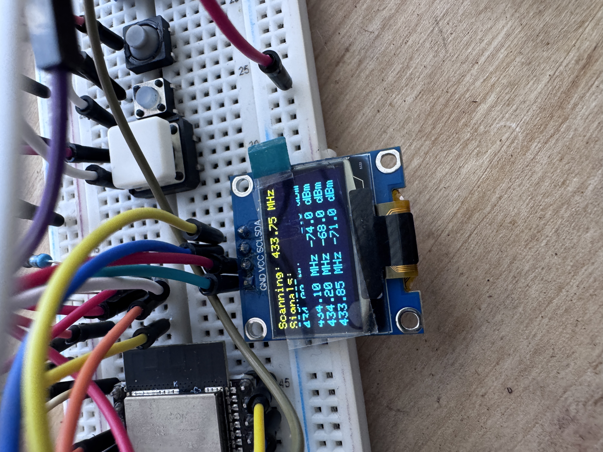
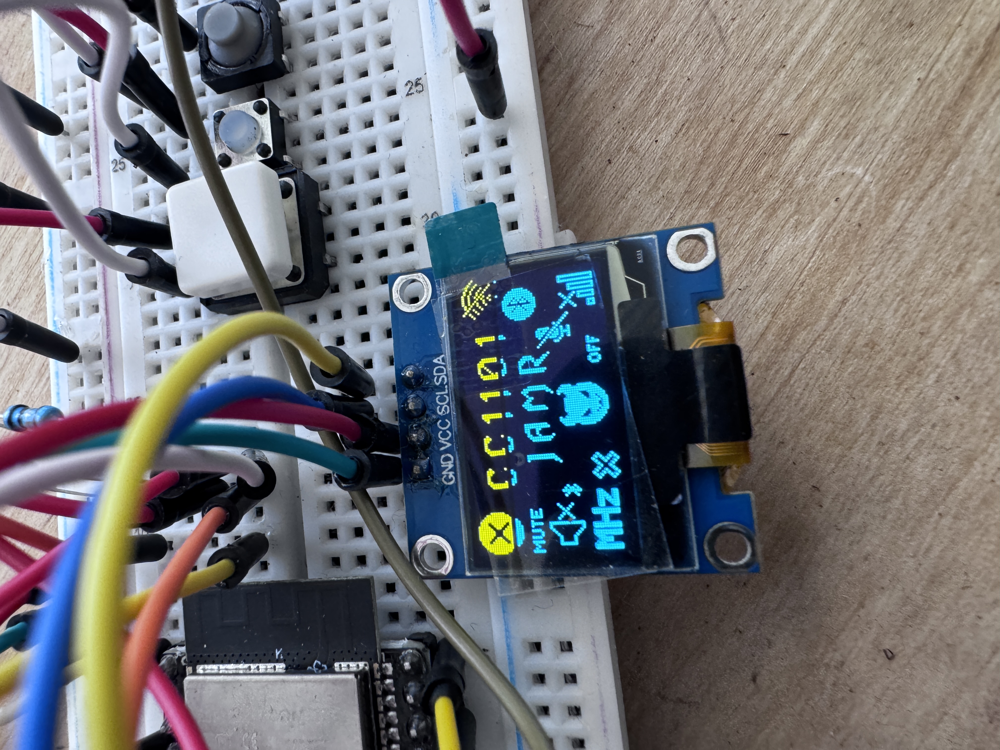

# 2x CC1101 Jammer Display ESP32

## Overview

This project is a CC1101 device inspired by the works of the Evil Crow RF tool, featuring a dual CC1101 radio system with an ESP32 microcontroller. The original work by Adam Loboda has been expanded with a modern OLED display interface, button controls, and dual (future version will have 5 cc1011's for the ultimate researchers) radio capabilities by Cypher of Little Hakr.
## WORK IN PROGRESS EXPECT SOME BUGS :)
![Hardware Setup]
*Hardware setup showing the ESP32, CC1101 modules, and OLED display*

## Features

- **Dual CC1101 Radio System**
  - Independent control of two CC1101 modules
  - Simultaneous or individual operation modes
  - Enhanced signal coverage and flexibility

- **Modern User Interface**
  - 128x64 OLED display
  - Intuitive menu system
  - Real-time status updates
  - Signal strength visualization

- **Button Controls**
  - Up/Down navigation
  - Select button for mode activation
  - LED feedback for button presses

- **RF Capabilities**
  - Signal jamming (single or dual radio)
  - Frequency scanning (433.60MHz - 434.20MHz)
  - Signal recording and playback
  - Raw data manipulation
  - RSSI monitoring

- **Frequency Presets**
  - 433.90MHz
  - 434.00MHz
  - 434.30MHz
  - 434.40MHz

## Hardware Requirements

*Required components for the project*

- ESP32 development board
- Two CC1101 radio modules
- SSD1306 OLED display (128x64)
- Three push buttons
- LED indicator
- Jumper wires
- Breadboard or custom PCB

## Pin Configuration
*Adjust to your needs!*

### CC1101 #1
- SCK: GPIO14
- MISO: GPIO12
- MOSI: GPIO13
- SS: GPIO15
- GDO0: GPIO26
- GDO2: GPIO27

### CC1101 #2
- SCK: GPIO18
- MISO: GPIO19
- MOSI: GPIO23
- SS: GPIO17
- GDO0: GPIO25
- GDO2: GPIO33

### Display & Controls
- OLED I2C: SDA=GPIO21, SCL=GPIO22
- Buttons: UP=GPIO34, DOWN=GPIO39, SELECT=GPIO32
- LED: Optional, not yet implemented, but choose extra pin

## Installation

1. Clone this repository
2. Install required libraries:
   - ELECHOUSE_CC1101_SRC_DRV
     - https://github.com/LSatan/SmartRC-CC1101-Driver-Lib
   - ELECHOUSE_CC1101_SRC_DRV2 (MUST BE ADDED TO YOUR Adruino/libraries folder!)
     - This is a heavily custom version of the CC1101 library. It technically is not needed, 
     - but this allows you to duplicate more libraries and have 2-5+ cc1101's if required! You're welcome :)
   - Adafruit_GFX
   - Adafruit_SSD1306
   - U8g2_for_Adafruit_GFX
   - EEPROM

3. Connect hardware according to pin configuration
4. Upload the sketch to your ESP32

## Usage

1. Power on the device
2. Navigate through the menu using UP/DOWN buttons
3. Select modes using the SELECT button
4. Monitor operations on the OLED display
5. Use serial monitor for additional control (115200 baud)

## Menu Options

- **2X CC JAM**: Activate both radios for jamming
- **CC#1 JAM**: Activate first radio only
- **CC#2 JAM**: Activate second radio only
- **SCAN**: Scan for RF signals (Edit code to change range, soon there will be a few ranges)
- **TEST_CC1101**: Test CC1101 radio connections
- **REC RAW**: Record raw RF data
- **PLAY RAW**: Playback recorded data
- **SHOW RAW**: Display recorded data
- **SHOW BUFF**: Show buffer contents
- **GET RSSI**: Display signal strength
- **FLUSH BUFF**: Clear recording buffer
- **STOP ALL**: Stop all operations
- **RESET CC**: Reset radio modules
- **Frequency Presets**: Quick frequency selection

## Credits

- Original CC1101 implementation by Adam Loboda (adam.loboda@wp.pl)
  - https://github.com/mcore1976/cc1101-tool
- Display, button interface, and dual radio implementation by Cypher of Little Hakr
  - https://linktr.ee/littlehakr
- Based on the Evil Crow RF project
  - https://github.com/joelsernamoreno/EvilCrow-RF

## License

This project is licensed under the Apache License. Little Hakr is for the people! Make this better if you're smart & creative enough! Good luck.

## Disclaimer

This tool is intended for educational and research purposes only. Always ensure you have proper authorization before testing RF equipment. The authors are not responsible for any misuse of this tool.

## Support

For issues and feature requests, please open an issue on GitHub.

---

*"The best way to predict the future is to create it." - Cypher of Little Hakr* 
